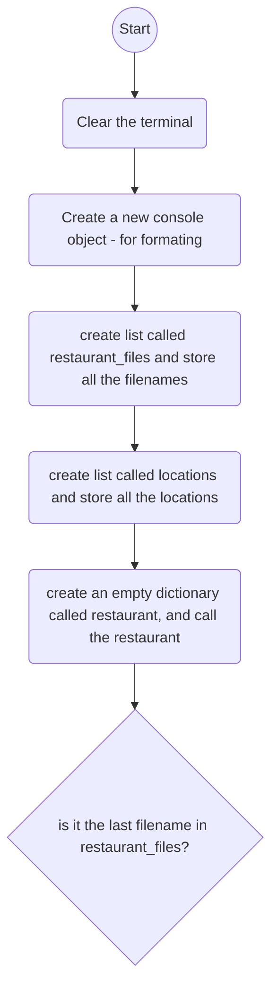

```mermaid
flowchart
%% the actual pieces
    start((Start))
    clear(Clear the terminal)
    console(Create a new console object - for formating)
    restaurantFilenames(create list called restaurant_files and store all the filenames)
    locations(create list called locations and store all the locations)
    restaurantObjects(create an empty dictionary called restaurant, and call the restaurant)
    lastInRestaurantFiles{is it the last filename in restaurant_files?}    
%% connections

%%initial variables 
start --> clear
clear --> console
console --> restaurantFilenames
restaurantFilenames --> locations
locations --> restaurantObjects

%% setting up the restaurants
restaurantObjects --> lastInRestaurantFiles
lastInRestaurantFiles
```