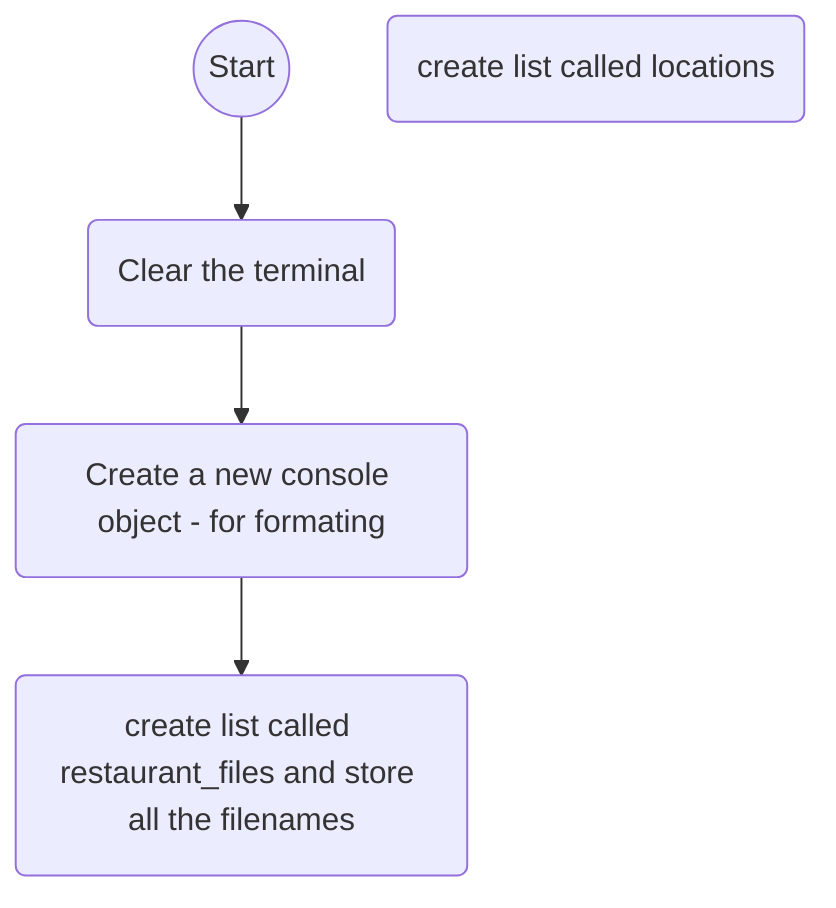

```mermaid
flowchart
%% the actual pieces
    start((Start))
    clear(Clear the terminal)
    console(Create a new console object - for formating)
    restaurantFilenames(create list called restaurant_files and store all the filenames )
    locations(create list called locations)
    
%% connections
start --> clear
clear --> console
console --> restaurantFilenames
```